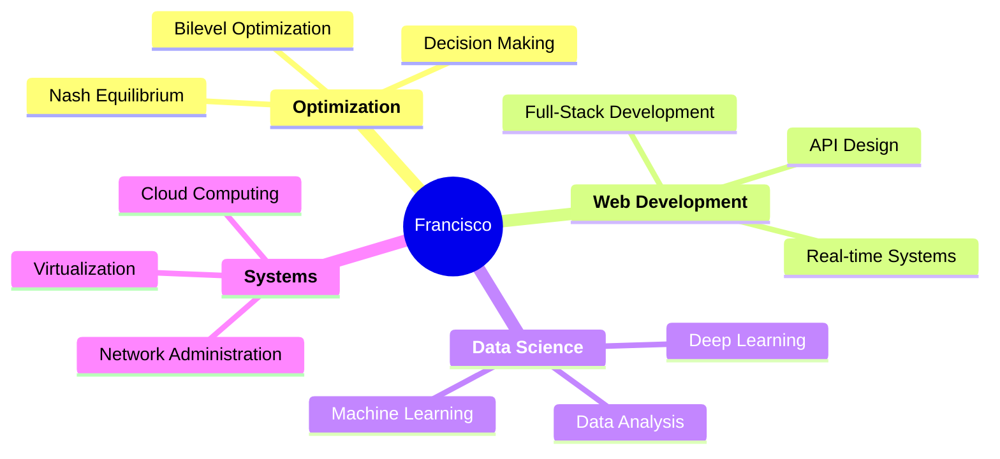

# Hello! 👋 I'm Francisco Vicente Suárez Bellón

  

**🎓 Computer Science Student | 🔬 Optimization Researcher | 💻 Full-Stack Developer**

---

## 🚀 About Me

I'm a passionate **computer scientist** specializing in **bilevel optimization** and **web development**. Currently studying at the University of Havana and working as a researcher on national science projects.

- 🔭 Currently working on: **Bilevel optimization applied to water resource management**
- 🌱 Learning: **Advanced Machine Learning and LLMs**
- 👨‍🏫 Teaching Assistant in **Programming and Database Management Systems**
- 🏗️ IT Systems Administrator at University of Havana
- 🎯 Aspiring **AI Engineer**

---

## 🛠️ Tech Stack

### Programming Languages

  
  
  
  
  
  

### Frameworks & Technologies

  
  
  
  
  
  

### Tools & Services

  
  
  
  
  

---

## 🎓 Academic Courses & Specializations

### 📚 **Machine Learning** 🤖

  
  
  
  

### 🧠 **LLM & Chatbot Applications**

  
  
  
  
  

### 📊 **Data Science**

  
  
  
  

### ⚡ **Optimization for Data Analysis (2025)**

  
  
  
  

---

## 🔬 Research & Featured Projects

### 🏆 **National Science Project PN223LH010-049**
**Optimization and Decision-Making for Industry**
- Implementation of bilevel optimization methods for recycled water management in eco-parks
- Development of simulations for management-company interactions
- Stack: Python (PuLP, Pyomo, NumPy, SymPy), Julia (JuMP, BilevelJuMP), Next.js

### 📚 **BilevelGen** - Julia Library
Generator of test problems with known stationary points for benchmarking bilevel optimization algorithms.

### 🏃‍♂️ **CaribesUH** - Real-time Web Platform
University sports event tracking system with .NET backend and PostgreSQL.

### 👁️ **SafeCross** - AI Assistant
Assistant system for visually impaired pedestrians using computer vision.

### 🌐 **InfoChord** - Distributed System
Information retrieval system built on Chord P2P protocol, enhanced with AI features.

---

## 📊 GitHub Stats

  
  

---

## 🎯 Areas of Expertise

---

## 🌟 Academic Experience

- 👨‍🏫 **Teaching Assistant** - Programming and Database Management Systems
- 🎓 **Advanced Courses**: Bilevel Optimization, Data Science, LLM and Chatbot Applications, Machine Learning
- 🔬 **Research**: Bilevel optimization and Nash equilibrium applied to eco-park water supply management

---

## 📫 Let's Connect!

  
  

---

  <i>"Optimization is not just about finding the best solution, but understanding the problem in all its complexity"</i>
  
  **Thanks for visiting my profile! 🚀**

